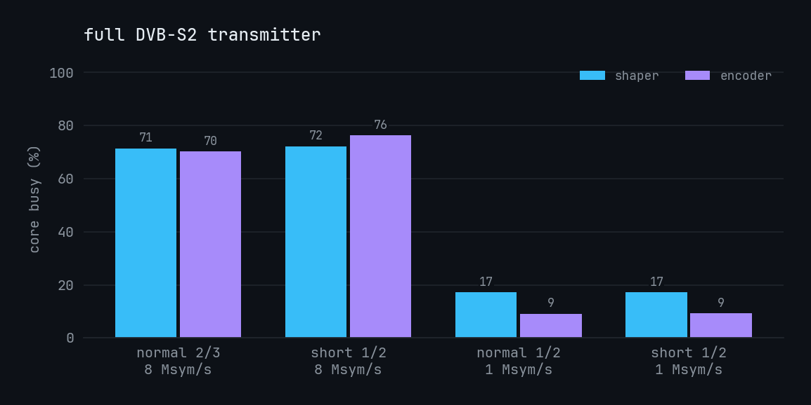
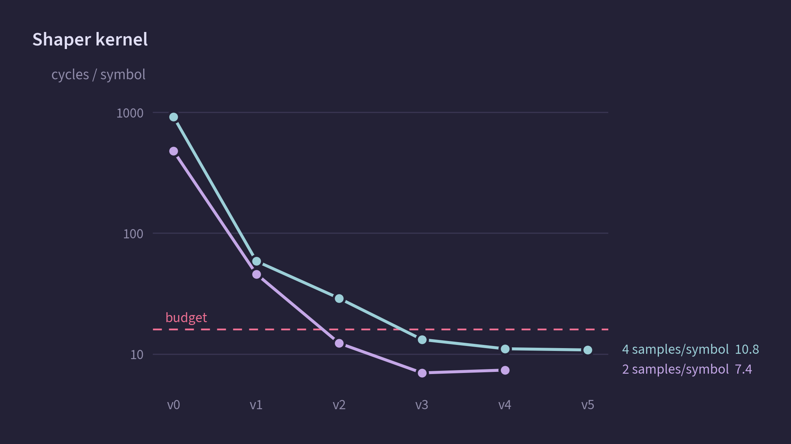
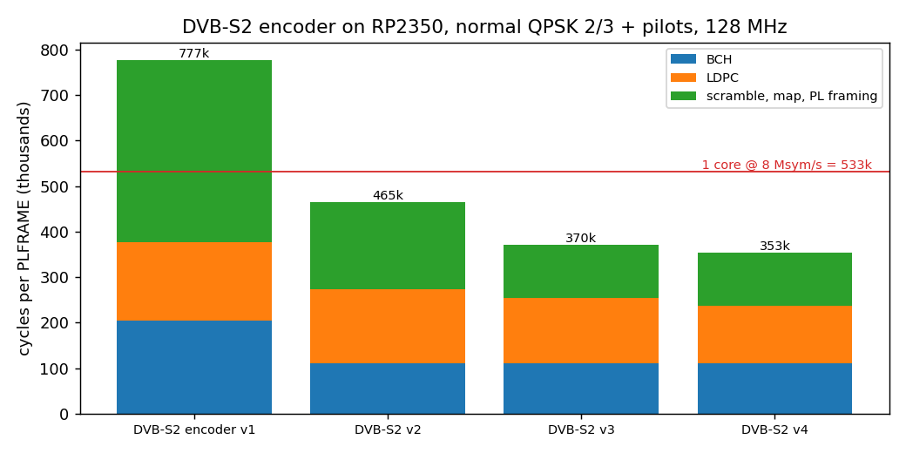
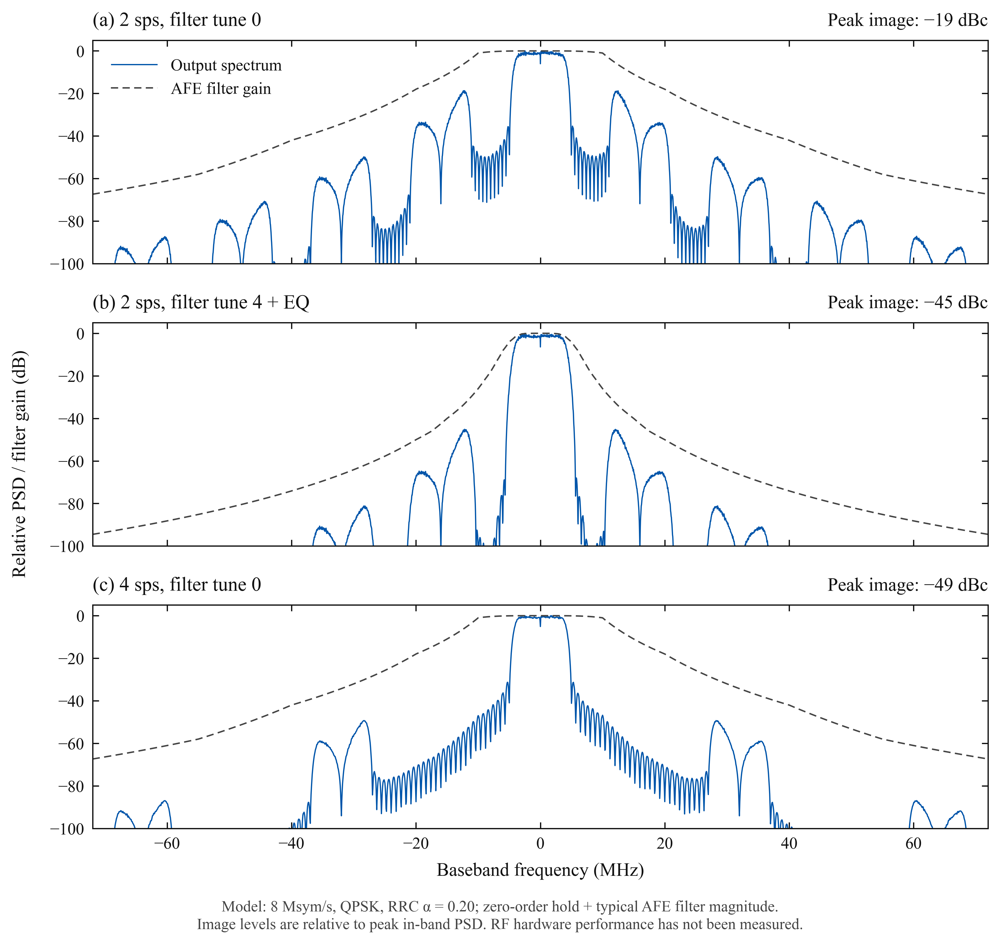

# RP2350 I/Q waveform benchmark

Can an RP2350 through the power of PIO replace the FPGA that generates a DVB-S2 QPSK waveform for a TI AFE7071 transmitter?

**Digital result: Yes, with margin!!!** A Pimoroni Pico Plus 2 (RP2350B
rev A2, 128 MHz, stock voltage) runs a complete DVB-S2 transmitter baseband:
- core 1 encodes: BB scrambling, BCH, LDPC, QPSK, PLHEADER, pilots, PL scrambling;
- core 0 pulse-shapes (RRC α = 0.20 over 12 symbols, 4 samples/symbol) and streams through DMA
  and PIO onto the AFE7071's 16-bit interleaved bus at 64 M words/s.

At 8 Msym/s, with TS arriving over SPI, the load is 79 % of core 1 and 76 % of core 0. A 60 s run
had no underruns, and the pins match the reference bit for bit. At 1 Msym/s (SATS) the whole
transmitter uses about 26 % of one core. Fed with camera TS from a real CM5 over one SPI lane at 20
MHz, it ran 210 s with no errors. The link is [PV-SPI](docs/pv-spi-spec.md), our own small protocol
on plain SPI: fixed 1332-byte messages of up to 7 TS packets plus a CRC-32, and a READY line for
flow control.



Of course, none of this shows RF performance: spectrum and EVM after the AFE, clock jitter, LO leakage, PA
behaviour and so much more. This is purely the waveform generation.

## Autonomous digital startup

`make build` produces both `firmware/build/iqbench.uf2` (existing USB command bench)
and `firmware/build/pvflight.uf2` (autonomous digital transmitter). The latter starts
without USB: stored profile is 128 MHz, 8 Msym/s, normal QPSK 2/3, pilots, 4 samples/symbol,
L=12, `lut_asm_p`, cpw=2. It runs until stopped, sending TS null packets when input is absent.
PV-SPI v1 is unchanged. External-input startup fills the rings with nulls, starts digital
output, then arms reception. GP22 READY means a free receive slot is armed while digital
output runs; it says nothing about RF readiness. Shutdown withdraws READY before stopping output.
No AFE, LO or PA configuration/enable is added; analog operation remains untested.

During autonomous TX, USB accepts only `status` and `stop` lines. Status is a bounded,
non-atomic live counter snapshot, at most once per second, with one buffered reply and no
wait for the host. Excess status requests are ignored; USB disconnect can lose a reply.
`stop` is checked once per millisecond, then exits at a shaping boundary and drains the
in-progress encoder frame (normally about 3 ms); these timings require board verification.
The ordinary final `stream` JSON includes complete per-run PV-SPI and pipeline counters.
`pvflight` disables the 1200-baud USB reset and vendor reset interface. There is no
USB BOOTSEL command during active transmission; `bootsel` is available after `stop`.
Physical BOOTSEL recovery (hold the button while resetting or powering up) remains available.
`iqbench` keeps its existing USB reset behavior.

After stop, `start` restarts the stored profile and the existing bench commands are available.
For a 120 s autonomous test, collect `status`, send CM5 SPI traffic, then `stop` for final
counters. `iqbench` still accepts `pvtx 2 120000 0` unchanged. This target has compiled and
passed host model/protocol tests; USB-free boot, disconnect/reconnect and 120 s continuity
have not yet been measured on the board. The companion CM5 state/data-flow source is
[software/architecture.drawio](../IREC/Pigeon_Vision/PigeonVision-website/software/architecture.drawio).

## Measured (Pico Plus 2, 128 MHz, SDK 2.2.0, GCC 14.2)

| test | result |
|---|---|
| **full TX, DVB-S2 normal QPSK 2/3 + pilots, 8 Msym/s, N = 4, L = 10** | encoder 70.4 % (core 1), shaper 72.0 % (core 0); 14 426 frames in 60 s; 0 underruns; 28 656 bus words captured, 0 mismatches |
| full TX, normal 1/2 + pilots, 1 Msym/s, N = 8 | encoder 9.2 %, shaper 17.2 %; clean, capture exact |
| full TX, short 1/2 + pilots, 1 Msym/s, N = 8 | encoder 9.3 %, shaper 17.2 %; clean, capture exact |
| shaper kernel, N = 4, L = 10 or 12 (`lut_asm_p`) | 10.80 cycles/symbol; 11.9 Msym/s per core |
| shaper kernel, N = 8 (`lut_asm`) | 20.9 cycles/symbol |
| DVB-S2 encoder, normal 2/3 + pilots | 353 k cycles/frame: BCH 110 k, LDPC 127 k, framing 116 k (357 k on the current build) |
| DVB-S2 encoder, short 1/2 + pilots | 93.5 k cycles/frame |
| shaper streaming with PIO input link (4 lanes, READY flow control) | 67.8 % of one core at 8 Msym/s; 16.0 Mb/s received |
| input link limit (1 lane, on-chip loopback) | 21.3 and 32 MHz SCK clean; 16 MHz flagged as short of the 16 Mb/s coded need |
| streaming at 150 MHz, PIO limit (2 clocks/word = 75 MW/s) | 9.375 Msym/s, clean |
| **PigeonVision TX (`pvtx`)**: TS over PV-SPI v1 → DVB-S2 normal 2/3 + pilots, 8 Msym/s, shaper L = 12 with a Kaiser window (β = 1), on-chip emulated master at 21 MHz, 60 s | 58 866 messages (981/s), 0 errors; BBFRAMEs match the gr-dtv-checked reference; encoder 78.9 %, shaper 75.6 %; capture exact |
| **`pvtx` from a real CM5**: two IMX900 cameras, 9 Mb/s TS, PV-SPI at 20 MHz, 210 s | 179 818 messages, CRC chains equal, 0 errors, 0 underruns. The Python sender cost about 1.5 fps per camera (28.4 vs 30.0) |
| `pvtx` from the native sender in the CM5 capture process, 120 s | 102 801 messages, CRCs matched, 0 errors, 0 underruns; 29.99 fps per camera (`results/cm5-spi`) |

L is the shaper's filter length in symbols. The transmitter (`pvtx`) uses L = 12 with a Kaiser
window, which passes the DVB-S2 spectrum mask. The optimization and full-TX runs used L = 10; the
kernel runs at the same speed either way, but the shaper's share of its core rises from 72 % to
76 % in the full transmitter.

Correctness chain:
- The firmware encoder is bit-exact against the Python DVB-S2 reference (`reference/dvbs2/`) for
  all 21 QPSK codes, with and without pilots. That was checked natively; on device, CRCs were
  checked for 4 codes.
- The Python reference is bit-exact against GNU Radio gr-dtv (commit aee9fd3) at five stages in
  all 42 configurations (`reference/dvbs2/README.md`).
- The shaper is bit-exact against the Python LUT model, which matches direct convolution within
  0.52 LSB.
- Stream checks capture the actual output pins with a PIO state machine running in sync with the
  output SM.
- No real receiver has decoded this output yet.... Coming soon to a repo near you!

## Optimization log

Every measurement is appended to `results/optimization-log.jsonl` with git revision, clock,
parameters and verification. `make plots` redraws the progress figures from it and
`make analyze` the filter figures, each as a 600 dpi PNG plus SVG and PDF in `results/plots/`.

Shaper, N = 4, L = 10 (cycles/symbol; budget 16 per core at 8 Msym/s):

| step | cyc/sym | change |
|---|---|---|
| v0 `conv` | 917.7 | direct convolution |
| v1 `lut_shift` | 58.6 | lookup table, shift-register history |
| v2 `lut_win` | 29.1 | 16-symbol windows; GCC spills and packs with UXTH/ORR |
| v3 `lut_pair` | 13.8 | PIO does the I/Q interleave; CPU stores table words unmodified |
| v4 `lut_asm` | 11.55 | hand-written Thumb-2, 8 instructions/symbol; predicted 11.5 |
| v4 + placement | 11.05; stream 73.3 → 69.2 % | tables in SRAM4–7, DMA ring in SRAM0–3, code in SRAM8 |
| v5 `lut_asm_p` | **10.80**; stream 67.8 % | software pipelining; floor about 10 |



DVB-S2 encoder, normal 2/3 + pilots (k cycles/frame; one core at 8 Msym/s = 533 k):

| step | frame | BCH | LDPC | framing | change |
|---|---|---|---|---|---|
| serial | – | 1 356 | 2 771 | – | bit-serial as the standard states it |
| v1 | 777 | 204 | 172 | 401 | byte-table BCH, 360-bit group LDPC |
| v2 | 465 | 110 | 163 | 192 | slicing-by-4 BCH, 32-bit symbol stream |
| v3 | 370 | 110 | 144 | 116 | unrolled transpose, scrambling folded into the bit-interleaved domain |
| v4 | **353** | 110 | 127 | 116 | LDPC rotate-XOR in streaming asm (GCC hoisted 24 loads and spilled) |



## Why 4 samples per symbol

The shaper sends the DAC 4 I/Q samples for every QPSK symbol, so at 8 Msym/s the AFE7071's DAC
runs at 32 MS/s (64 M bus words/s, I and Q interleaved). A DAC's output also carries copies of the
signal, called images, around every multiple of its sample rate. The AFE7071 has no interpolator,
only a gentle on-chip low-pass, so the sample rate decides how far out those copies land and how
much of them the filter removes:
- 4 samples/symbol: first image at 27 MHz, modelled at −49 dBc with the widest filter setting.
- 2 samples/symbol: first image at 11 MHz, −19 dBc. It reaches −45 dBc only with the tune-4 filter
  and a matching pre-equaliser, and moves ±4 dB for a ±10 % filter-corner error.

The E200 can take "2 samples/symbol" because its AD9363 interpolates to a much higher DAC rate
internally. Details are in `docs/derivations.md` §2.



## Estimates, not measured

- Parallel-bus setup/hold margin ≈ 5.7 ns at 64 MW/s against 1 ns required, from RP2350 QMI pad
  data rather than a PIO figure (`hardware/devboard/README.md`).

## Resources (current firmware)

| resource | used |
|---|---|
| SRAM0–3 (256 KB) | 30.8 KB .data (hot code) + 213 KB .bss (DMA ring 128 KB, input rings 2 × 32 KB, idle block) |
| SRAM4–7 (256 KB) | 251.6 KB: shaper tables 64 KB, capture 56 KB, DVB-S2 buffers and tables. 4.4 KB free |
| SRAM8 | 1.2 KB hot kernels (plus core-1 stack) |
| PIO | PIO0: output SM, capture SM (verification). PIO1: 4-lane link (test). PIO2: PV-SPI receiver, CS watcher, emulator (test) |
| DMA | 2 output, 1 capture, 1 PV-SPI (+2 for the emulator) or 2 link |
| GPIO | 0–16 AFE bus (D0–13, IQ_FLAG, spare, CLK_IO); 17–22 PV-SPI or 4-lane link |

## Reproduce

```sh
make test                               # host-native shaper kernels vs Python model
python3 host/test_dvbs2_native.py       # C DVB-S2 encoder vs Python reference, 21 codes x pilots
python3 reference/dvbs2/test_dvbs2.py   # Python reference self-checks and gr-dtv/leansdr digests
make analyze                            # filter/image analysis -> results/plots
make build flash                        # ~/.pico-sdk (VS Code extension); BOOTSEL or running iqbench
make smoke                              # every command once on the board, about 1 s each
make bench                              # shaper kernel sweep
python3 host/iqbench.py dvbs2 3 5 6 14                                          # encoder stages
python3 host/iqbench.py txs2 5 lut_asm_p 4 10 --cpw 2 --ms 60000 --cap 14336   # full TX, 8 Msym/s
python3 host/iqbench.py txs2 3 lut_asm 8 10 --cpw 8 --ms 5000 --cap 8192       # full TX, 1 Msym/s
make plots
```

## Layout

```
reference/   iqlut.py (shaper model), analyze.py, gen_coeffs.py, gen_dvbs2_codes.py, dvbs2/ (DVB-S2 reference)
firmware/    Pico SDK project: tx.c (transmit path), bench.c, iqgen.c / iqasm.S (shaper), dvbs2.c
             (encoder), iqout.c (PIO/DMA), pvspi.c (PV-SPI), link.c, main.c (command line)
host/        iqbench.py (board driver + verification), native tests, plot_progress.py
host/cm5/    PV-SPI reference sender and the CM5 camera-run harness
results/     optimization-log.jsonl, reference analysis, plots, cm5-spi/ (real CM5 runs)
docs/        pv-spi-spec.md, derivations.md, host-link.md, rp2350-notes.md, sats-self-contained.md,
             sources/SOURCES.md (all references)
hardware/    transmitter hardware draft: interfaces, shared RF core, IREC and SATS modules
```

## Next steps

1. Decode with gr-dvbs2rx: capture encoder symbols on the board (about 6 frames fit) and shape
   them with the bit-exact host model.
2. Encoder load for all 21 codes at 8 Msym/s; normal 3/4 already costs 10 % more than 2/3.
   BCH in streaming asm would save about 25 k cycles/frame?
3. Extra long soak test
5. RF daughterboard on the Pico Plus 2 (`hardware/devboard/README.md`): spectrum, mask, images, LO
   leakage.
